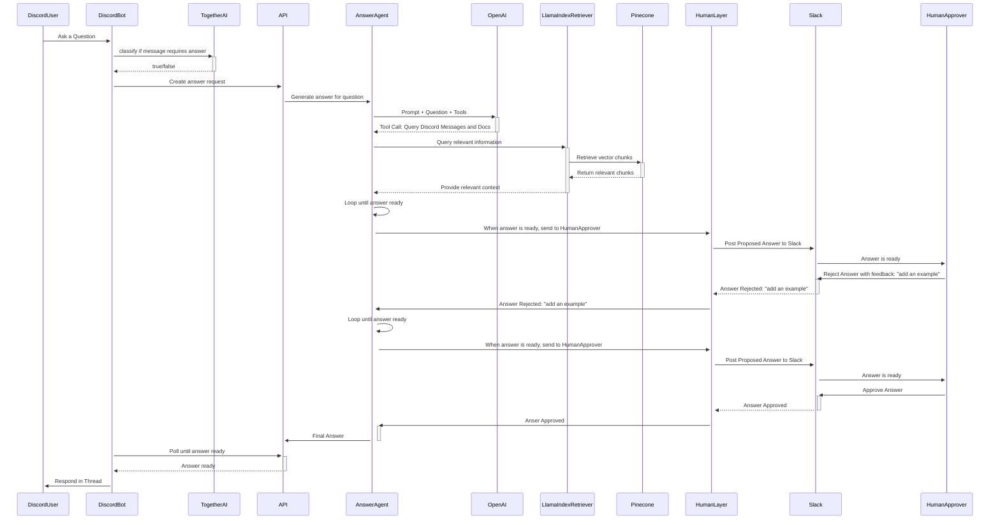

# Notorious RAG

Notorious RAG is an AI Agent that responds to user questions in discord. This early version is optimized for developer tooling communities and will soon be rolled out to support the Discord community for https://github.com/BoundaryML/baml.

As communities grow, new users often have similar questions to what have been answered before. A lot of us have had this issue in managing developer tools and developer communities, but it's often more effort to go find the previous answer than to just answer it again. We wanted to tackle this with LLMs, but with a very high quality bar.

## The Challenge

Today's LLMs are good enough to do 90% of the work and to get the answer right ~90% of the time, but there's a lot of nuance in replying in a way that:

- Makes the user feel heard
- Doesn't feel like a canned AI response
- Genuinely solves the problem

For people building developer tools, community members are precious, and developers have very low patience for low-effort or low quality community support. Most folks who try to answer community questions with LLMs tend to find that there are enough bad results that:

In order to make a reply bot that saves people time without alienating community members, we applied the following key approaches:

1. Use RAG against previous discord replies from humans as context for answer formulation
2. Implement low-friction human approval to ensure all answers are very high quality


## Running it

### set env vars

```
cp env.example .env
```

Then fill out the various credentials.

You'll need to provision accounts for:
- HumanLayer
- Arise
- OpenAI
- 
- Discord Bot w/ Token (permissions required todo)

## Perform initial ingest

(todo)

### Run UI and API

Run the frontend

```
npm install -g pnpm
npm -C webapp install
npm -C webapp run dev
```

Run the api server (also launches discord bot)

```
uv sync
uv run python api/hello.py
```


### Diagram


