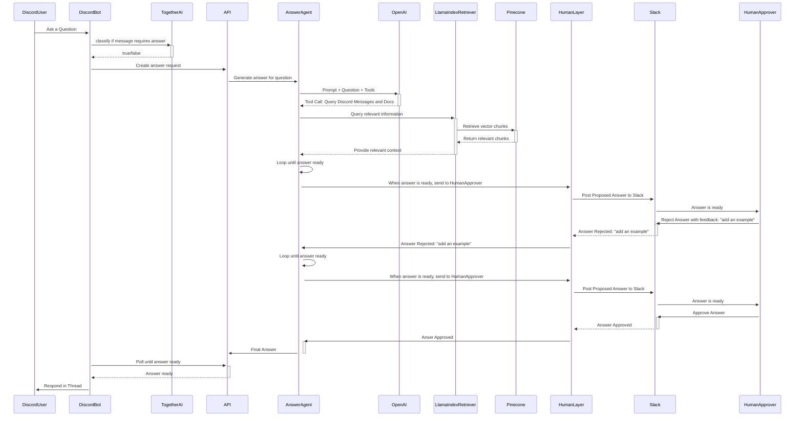

### Diagram

```mermaid
sequenceDiagram
    participant DiscordUser 
    participant DiscordBot 
    participant TogetherAI 
    participant API
    participant AnswerAgent 
    participant OpenAI
    participant LlamaIndexRetriever
    participant Pinecone
    participant HumanLayer
    participant Slack
    participant HumanApprover

    DiscordUser->>+DiscordBot: Ask a Question
    DiscordBot->>+TogetherAI: classify if message requires answer
    TogetherAI-->>-DiscordBot: true/false
    DiscordBot->>+API: Create answer request
    API->>+AnswerAgent: Generate answer for question
    AnswerAgent->>+OpenAI: Prompt + Question + Tools
    OpenAI-->>-AnswerAgent: Tool Call: Query Discord Messages and Docs
    AnswerAgent->>+LlamaIndexRetriever: Query relevant information

    LlamaIndexRetriever->>+Pinecone: Retrieve vector chunks
    Pinecone-->>-LlamaIndexRetriever: Return relevant chunks
    LlamaIndexRetriever-->>-AnswerAgent: Provide relevant context
    AnswerAgent->>+AnswerAgent: Loop until answer ready
    AnswerAgent->>+HumanLayer: When answer is ready, send to HumanApprover
    HumanLayer->>+Slack: Post Proposed Answer to Slack
    Slack->>+HumanApprover: Answer is ready
    HumanApprover->>+Slack: Reject Answer with feedback: "add an example"
    Slack-->>-HumanLayer: Answer Rejected: "add an example"
    HumanLayer->>+AnswerAgent: Answer Rejected: "add an example"
    AnswerAgent->>+AnswerAgent: Loop until answer ready
    AnswerAgent->>+HumanLayer: When answer is ready, send to HumanApprover
    HumanLayer->>+Slack: Post Proposed Answer to Slack
    Slack->>+HumanApprover: Answer is ready
    HumanApprover->>+Slack: Approve Answer
    Slack-->>-HumanLayer: Answer Approved
    HumanLayer->>+AnswerAgent: Anser Approved
    AnswerAgent->>-API: Final Answer
    DiscordBot->>+API: Poll until answer ready
    API-->>-DiscordBot: Answer ready
    DiscordBot->>+DiscordUser: Respond in Thread
```
